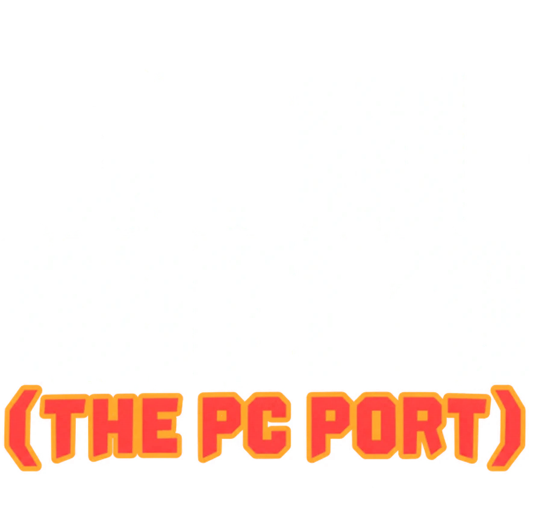

<p align="center"></p>

# CTW-Native

GTA: Chinatown Wars as a native Windows game, rebuilt in C++ with SDL2 and OpenGL. It runs from the game files of
your own Android **4.4.243** copy; none are included here. A fan project, not affiliated with Rockstar Games or
Take-Two. [STATUS.md](STATUS.md) says what works.

## Play it

1. Download **CTW-Native-Porter.exe** from [Releases](../../releases/latest).
2. Start it, drop your GTA: Chinatown Wars APK (Android 4.4.243) on it and press **Port it**.
3. Press **Play**, or use the shortcut on your desktop.

The Porter writes a folder with the game in it:

```text
GTA Chinatown Wars PC/
  GTACTW.exe      the game
  data/           the game files from your APK
  mods/           the mod menu (F4) and the example mods
```

The folder can be moved anywhere. Windows 10 or 11, 64-bit.

See [CONTROLS.md](CONTROLS.md) for the keys.

## Mods

Press **F4** in the game for the mod menu. A mod can contain texture changes, a C or C++ DLL, or both in one folder.
The bundled **Enhancements** mod adds a third-person camera (**V**, then the mouse) and PSP-style lighting. See the [modding guide](ctw-modkit/README.md).

## Build from source

Windows x64 with Python 3.10+, Git, CMake 3.20+, Ninja and a MinGW-w64 toolchain (GCC or LLVM-MinGW) on your PATH.
MSVC is not supported because of the game's fixed-point arithmetic.

```text
python -m pip install -r requirements-setup.txt
python scripts/setup_game.py                    # your APK from input/ into port/data
cmake -S . -B port/build -G Ninja -DCMAKE_BUILD_TYPE=Release
cmake --build port/build
port/build/GTACTW.exe --data port/data
```

The build also makes `ctw_showcase.exe` (an asset and world viewer) and the mod kit in `port/build/mods/`.
Building needs no game files; running does. `python scripts/export_pc.py` writes the same standalone folder as the
Porter from a local build (`--with-modkit` adds the mod menu and the examples). The Porter itself is in
[porter/](porter/README.md).

## Tests

```text
ctest --test-dir port/build --output-on-failure
python -m unittest discover -s tests -v
```

## License

Project code is licensed under **GPL-3.0-only**, see [LICENSE](LICENSE); `GTACTW.exe --license` prints the notice.
Third-party components keep their own licenses, see [THIRD_PARTY.md](THIRD_PARTY.md). The license does not cover
the original game's code, assets or trademarks.

[Contributing](CONTRIBUTING.md) | [Mod kit](ctw-modkit/README.md) | [Porter](porter/README.md) | [Discord](https://discord.gg/ZXTvWB7gnb)
